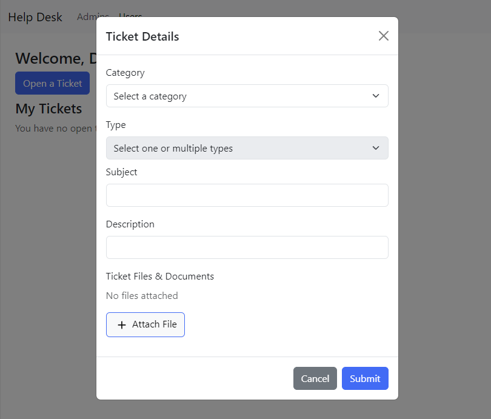

# Dev Exercise Help Desk

This vue app is meant to showcase a small help desk ticket interface, and also serves as my first project using vue and boostrap.



## To Run

There are two primary ways to run this application on your machine.

### Docker

If you have Docker installed, execute this command in the root of the project directory:

```sh
docker compose up -d
```

The app will be available at localhost:8080

To close the container:

```sh
docker compose down
```

Note: this command will not delete the docker image.

### Without Docker

To run the app locally, first install the necessary node packages:

```sh
npm install
```

then:

```sh
npm run dev
```

The url will be displayed in the terminal.

For a minimized build, run:

```sh
npm run build
```

## Functionality

Click the 'Open a Ticket' button open a new ticket form.

Select a category and type, and input the subject and description. Multiple types may be selected. Click on a selected type to remove it.

Optionally, lick 'Attach File' to simulate adding a relevant file. You may delete attached files individually.

Click 'Cancel' or the close button to clear and close the form.

Click 'Submit' to save the ticket. If required fields are empty, the form will visually indicate empty fields. If the form is properly filled, it will close. The ticket will then be added to the 'My Tickets' section.

Clicking on a ticket in the list wille expand the view, and it's details will be visible. Clicking 'Delete Ticket' will permanently remove it.

## Requirements

1. Category: Dropdown menu with Hardware, Software, Network, In-Processing
2. Type: Dropdown menu dependent on category. Must be able to select multiple types.
   Hardware - Laptop, Mobile, Peripherals, Desk Phone, Printers, Other
   Software - Teams/Zoom, Mobile Blackbury, Adobe, Outlook, Microsoft Office, Other
   Network - Network Access, Connectivity, VPN, Drivers, Other
   In-Processing: Access Badge, Common Access Card (CAC), SIPR, Trello
3. Subject: An input field.
4. Description: An input field.
5. Ticket Files & Documents: A button that adds a pretend file named 'nameoffileattached.ext' with a file number after it so that when you press it multiple times, it will increment. i.e. 'nameoffileattached1.ext.'
6. Cancel: A button that should clear the form completely.
7. Submit: A button that will submit all the informtaion and return to a ticket details view.
8. Have a frontpage that displays all your 'Tickets' and a button that sends you to the form.
   a. Have the ability to view the 'Ticket Details' of each displayed ticket by clicking on that ticket.
   b. Have a method to return to the main page when filling a form.
   c. Have the ability to delete a ticket.
9. Incorporate some type of visual validation to the form fields.
10. Add the trach-can icon and ability to delete pretend files.

## Future Work

- Add a ticket view to the Admins tab, so that a feaux admin can 'accept,' 'reject,' or 'complete' tickets submited by users.
- Add a confirmation modal when users click 'Delete Ticket.'
- Add a login-authentication system so that multiple users can submit tickets, view only their own tickets, and admins can view which user submitted which ticket.
- Add a database for the tickets and a RESTful API.

## Known Issues

- If you switch category after selecting a type, it will remove the selected types. However, the dropdown maintains the position of the last type choice. This leads to incorrect form validation. I have tried several ways around this, but I believe the biggest issue is with my implementation of the dropdown.
